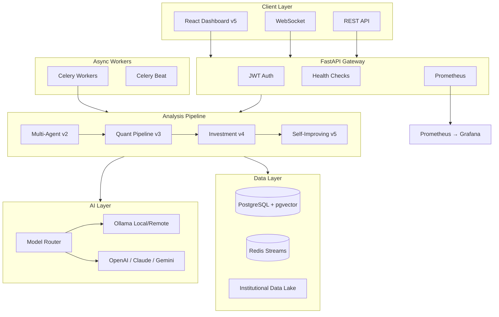

# CryptoGhost

[](https://www.python.org/)
[](https://fastapi.tiangolo.com/)
[](https://react.dev/)
[](https://docs.docker.com/compose/)
[](https://github.com/pgvector/pgvector)
[](https://redis.io/)
[](https://ollama.com/)
[](LICENSE)
[](tests/)
[](tests/)

**Self-Improving Institutional Quantitative AI Platform**

CryptoGhost is an **AI Quant Platform**, **Institutional Intelligence Engine**, and **Self-Improving Financial AI Infrastructure** — evolving through five generations without removing a single module.

> Personal/family use · Own accounts only · Official APIs · Paper trading by default · Capital preservation first

---

## Overview

| Version | Codename | Focus | Modules |
|---------|----------|-------|---------|
| **v1** | Trading Bot | Automated paper/live trading | Core engine, risk, Celery |
| **v2** | Intelligence | Multi-agent explainable AI | 10 intelligence modules |
| **v3** | Quant | Institutional quant infrastructure | RL, feature store, ensemble, GPU |
| **v4** | Investment | Smart investment prioritization | 13 modules + AI Router |
| **v5** | Self-Improving | Meta-learning, drift, survival | 14 auto-evolving modules |

**All v1–v4 modules remain fully functional in v5.**

---

## Architecture



### Full Analysis Flow

```
POST /api/v1/intelligence/analyze/BTC/USDT
  → v2 Multi-Agent Intelligence
  → v3 Quant Enhancement (RL, ensemble, calibration)
  → v4 Investment Prioritization (ranking, allocation)
  → v5 Self-Improvement (validation, drift, survival)
```

---

## Key Features

### v5 — Self-Improving (14 modules)
Meta Learning · Self Improvement · Data Lake · Orderflow AI · Timing Optimization · Portfolio Survival · Prediction Validation · Strategy Evolution · Drift Detection · Performance Tracker · AI Truth Engine · Adaptive Weighting · Institutional Backtesting · Market State Intelligence

### v4 — Investment Intelligence (13 modules)
Investment Prioritizer · Opportunity Scoring · Predictive Profit · Risk/Reward Optimizer · Capital Allocator · Institutional Signals · Smart Position Sizing · AI Forecast · Probabilistic Analysis · Adaptive Portfolio · Alpha Detection · Profit Probability · Smart Asset Ranking · **AI Router**

### v3 — Quant Infrastructure (12 modules)
Reinforcement Learning (DQN/PPO/SAC) · Feature Store · Event Bus · AI Calibration · Scenario Similarity · GPU Inference · Ensemble Engine · Temporal Memory · Adaptive Strategy · Simulation Engine · Performance Lab · Market Replay

### v2 — Multi-Agent Intelligence (10 modules)
Market Analyst · Risk AI · Sentiment · Portfolio · Regime · XAI · Macro · Heatmap · Consensus · Orchestrator

### v1 — Trading Core
Paper/Live trading · CCXT exchanges · Risk management · Circuit breaker · JWT auth · WebSocket realtime

---

## Tech Stack

| Layer | Technology |
|-------|------------|
| Backend | Python 3.12, FastAPI, SQLAlchemy 2, Alembic |
| Frontend | React 18, TypeScript, Vite, Recharts |
| Database | PostgreSQL 16 + pgvector |
| Cache/Queue | Redis 7, Celery 5 |
| AI | Ollama (local/remote), OpenAI, Anthropic, Gemini |
| ML | PyTorch, TensorFlow, scikit-learn, SHAP |
| Trading | CCXT, pandas-ta |
| Observability | Prometheus, Grafana, structlog, Sentry (opt-in) |
| Infrastructure | Docker Compose |

---

## Quick Start

### 1. Clone & Configure

```bash
git clone https://github.com/your-org/CryptoGhost.git
cd CryptoGhost
cp .env.example .env
# Edit .env — generate secrets: openssl rand -hex 32
```

### 2. Start Development Environment

```bash
python start_dev.py
```

Or full Docker stack:

```bash
python start_dev.py --all-docker
```

### 3. Access Services

| Service | URL |
|---------|-----|
| API / Swagger | http://localhost:8000/docs |
| Dashboard | http://localhost:5173 |
| Health (full) | http://localhost:8000/health/full |
| Prometheus | http://localhost:9090 |
| Grafana | http://localhost:3000 |

### 4. Run Tests

```bash
pytest tests/ -v
python scripts/test_full_stack.py
python scripts/scan_secrets.py
```

---

## Ollama — Local or Remote

**Local** (Docker):
```env
CRYPTOGHOST_OLLAMA_BASE_URL=http://localhost:11434
```

**Remote GPU server:**
```env
CRYPTOGHOST_OLLAMA_URL=http://your-ollama-host:11434
CRYPTOGHOST_OLLAMA_MODEL_PRIMARY=llama3.2:latest
CRYPTOGHOST_OLLAMA_MODEL_SECONDARY=deepseek-r1
```

Features: exponential retry · model fallback · automatic name resolution · health monitoring

---

## Health Checks

| Endpoint | Description |
|----------|-------------|
| `GET /health` | Basic status |
| `GET /health/db` | PostgreSQL + pgvector |
| `GET /health/redis` | Redis connectivity |
| `GET /health/ollama` | Ollama + model availability |
| `GET /health/celery` | Broker + workers |
| `GET /health/full` | Complete diagnostic |

---

## API Highlights

| Endpoint | Description |
|----------|-------------|
| `POST /api/v1/intelligence/analyze/{symbol}` | Full v2→v5 analysis pipeline |
| `GET /api/v1/investment/best-opportunity` | Top investment opportunity |
| `GET /api/v1/v5/dashboard` | Self-improving dashboard |
| `GET /api/v1/quant/dashboard/{symbol}` | Quant institutional dashboard |
| `GET /metrics` | Prometheus metrics |

See [API Documentation](docs/api.md) for the complete reference.

---

## Project Structure

```
CryptoGhost/
├── backend/              # FastAPI + all AI modules (v1–v5)
├── frontend/dashboard/   # React terminal-style dashboard
├── docs/                 # Architecture, API, deployment guides
├── docker/               # Dockerfiles, Prometheus, Grafana
├── infrastructure/       # Infrastructure documentation
├── monitoring/           # Observability documentation
├── scripts/              # Utilities, scanners, backtests
├── tests/                # Pytest suite (75+ tests)
├── database/             # PostgreSQL init (pgvector)
├── datasets/             # Sample datasets (raw data gitignored)
├── notebooks/            # Research notebooks
├── docker-compose.yml
├── docker-compose.dev.yml
├── start_dev.py
└── .env.example
```

---

## Security

- **Paper trading enabled by default** — live trading requires explicit opt-in
- `.env` never committed — use `scripts/scan_secrets.py` before release
- JWT authentication on protected endpoints
- Prompt injection protection in AI Router
- Circuit breaker and daily loss limits

See [SECURITY.md](SECURITY.md) for the full security policy.

---

## Observability

- Prometheus metrics at `/metrics`
- Grafana dashboards (port 3000)
- Structured logs: `[STARTUP]`, `[DATABASE]`, `[OLLAMA]`, `[CELERY]`, etc.
- Optional Sentry integration

See [Monitoring Guide](monitoring/README.md).

---

## Documentation

| Document | Link |
|----------|------|
| Documentation Index | [docs/README.md](docs/README.md) |
| Architecture | [docs/architecture.md](docs/architecture.md) |
| AI Strategy | [docs/ai_strategy.md](docs/ai_strategy.md) |
| API Reference | [docs/api.md](docs/api.md) |
| Deploy | [docs/deploy.md](docs/deploy.md) |
| Contributing | [CONTRIBUTING.md](CONTRIBUTING.md) |
| Changelog | [CHANGELOG.md](CHANGELOG.md) |
| Roadmap | [ROADMAP.md](ROADMAP.md) |
| GitHub Release | [docs/github_release.md](docs/github_release.md) |

---

## Roadmap

Next milestones: Execution Engine · Advanced RL · Live Micro-Trading · Institutional Execution · Calibration AI · Distributed Inference · GPU Cluster · Vector Intelligence · Autonomous Strategy Evolution

See [ROADMAP.md](ROADMAP.md) for details.

---

## Release

**Current:** v5.0.0 — *CryptoGhost v5 — Self-Improving Institutional AI*

```bash
python scripts/pre_release_check.py
```

See [GitHub Release Guide](docs/github_release.md) for publishing instructions.

---

## Legal Disclaimer

CryptoGhost is provided **as-is** under the [MIT License](LICENSE). It is **not financial advice**. Users are solely responsible for compliance with applicable laws, tax obligations, and the security of their API credentials. Automated trading involves substantial risk of loss. Operate only on accounts you own using official exchange APIs.

**Priority: Security > Capital Preservation > Alpha**

---

<p align="center">
  <strong>CryptoGhost v5.0</strong> — Self-Improving Institutional Quantitative AI<br>
  Built for personal intelligence. Designed for institutional quality.
</p>
