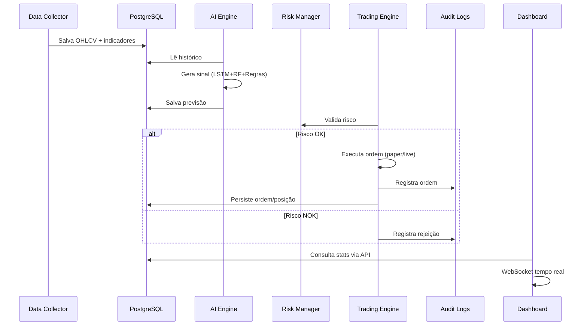

# CryptoGhost — Arquitetura do Sistema

## Princípios

1. **Modularidade**: cada domínio em módulo independente
2. **Segurança first**: paper trading default, live com confirmação explícita
3. **Observabilidade**: logs estruturados, Prometheus, Grafana, Sentry
4. **Auditoria**: toda decisão registrada no PostgreSQL

## Fluxo de Dados

## Stack Tecnológica

| Camada | Tecnologia |
|--------|------------|
| API | FastAPI, WebSockets, JWT |
| Tasks | Celery + Redis |
| DB | PostgreSQL, SQLAlchemy, Alembic |
| ML | PyTorch (LSTM), scikit-learn, TensorFlow |
| Trading | CCXT, Alpaca*, MetaTrader5* |
| Frontend | React, TypeScript, Vite, Recharts |
| Infra | Docker, Prometheus, Grafana, GitHub Actions |

*Integrações opcionais configuráveis

## Microsserviços / Módulos

Todos os módulos residem em `backend/` e comunicam-se via:
- **Síncrono**: imports Python diretos (API → engines)
- **Assíncrono**: Celery tasks (coleta, IA, risco)
- **Persistência**: PostgreSQL compartilhado
- **Cache/Fila**: Redis

## Escalabilidade

- Horizontal: múltiplos Celery workers
- Vertical: pool de conexões PostgreSQL configurável
- Rate limit: CCXT `enableRateLimit` + circuit breaker interno
